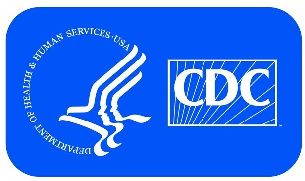

# Foodborne Illness

##Table Of Contents
* [Summary](#Summary)
* [Motivation](#Motivation)
* [Analysis](#Analysis)
* [Tools Used](#Tools Used)
* [Visualizations](#Visualizations)

## SUMMARY
Foodborne illness is a serious but manageable problem in the United States.
This project will be an exploration of the extent, causes and effects of
foodborne illness. Data from the United States Department of Agriculture and
the Centers for Disease Control will be analyzed to explore the effects of
foodborne illness on people, the costs associated with sicknesses and
hospitalizations. The project will also consider the distribution of illnesses
across the United States and sources of contamination.

## MOTIVATION
I have chosen foodborne illness as the subject for my capstone project. I have
worked in the food manufacturing industry in the past and that experience has
brought about a passion for the subject as well as knowledge I can use to bring
to light the seriousness of this issue. There are a system of programs and
safeguards in place at every step from the farm to the table, but foodborne
illness still occurs. I plan to explore possible reasons for that.

##Analysis

##Tools Used

##Visualizations

