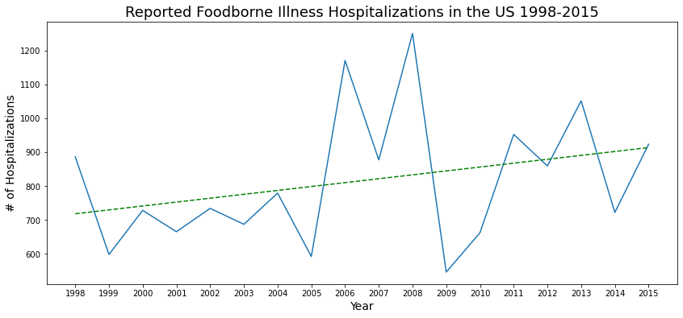

# Foodborne Illness

## Table Of Contents
* [Summary](#Summary)
* [Motivation](#Motivation)
* [Analytical Approach](#Analytical-Approach)
* [Tools Used](#Tools-Used)
* [Analysis](#Analysis)
* [Link to Tableau Dashboard](#Link-to-Tableau-Dashboard)
* [Sources](#Sources)

## Summary
Foodborne illness is a serious but manageable problem in the United States.
This project will be an exploration of the extent, causes and effects of
foodborne illness. Data from the United States Department of Agriculture,
Economic Research Service and the Centers for Disease Control will be analyzed
to explore the effects of foodborne illness on people, the costs associated
with illnesses and hospitalizations. The project will also consider the
distribution of illnesses across the United States and possible sources of
contamination.

## Motivation
I have chosen foodborne illness as the subject for my capstone project. I have
worked in the food manufacturing industry in the past and that experience has
brought about a passion for the subject as well as knowledge I can use to bring
to light the seriousness of this issue. There are a system of programs and
safeguards in place at every step from the farm to the table, but foodborne
illness still occurs. I plan to explore possible reasons for that.

## Analytical Approach
I pulled a dataset on reported cases of foodborne illness from 1998 to 2015 from the CDC.
This dataset included the number of illnesses, hospitalizations and deaths associated
with foodborne illness. The dataset also contained information on causative agents,
state where the illness occurred, location where the food was prepared and the food vehicle
associated with the illnesses that allowed me to filter the illnesses and group them
by these factors. I also pulled a dataset from the USDA ERS that described estimated
monetary costs of foodborne illness. The cost estimates were due to visits to physicians, hospitals, emergency rooms, etc. and also included cost estimates of lost productivity, chronic conditions resulting from the illnesses and premature death.
My analysis of the data centered on three questions:
- What effect does foodborne illness have on the people of the United States?
- What are monetary costs associated with foodborne illness?
- What are possible sources of contamination that can be better controlled to make food safer for consumption?

## Tools Used
- Excel - Original format of data, used for some EDA
- Python - EDA, building dataframes, analysis and visualizations
- Tableau - Visualization dashboard
- Atom - Text editor used to write the ReadMe file
- Git - Used for version control

## Analysis
#### Number of Illnesses per Year
- Mean number of illnesses over this timeframe was 20,752 per year
- Seems to be decreasing over this timeframe
- Hypothesis test to see if slope of line is 0: p-value: <0.0001
- P-value: <0.05 so there is a change over time
- Change in reporting process in 2009 that could account for this change

#### Number of Hospitalizations per Year
- Mean number of hospitalizations over this timeframe was 816 per year
- Increasing over this timeframe?
- Hypothesis test to see if slope of line is 0: p-value: 0.2117
- P-value: >0.05 so there is no change over time

#### Number of Deaths per Year
- Mean number of deaths over this timeframe was 19 per year
- Slightly increasing over this timeframe?
- Hypothesis test to see if slope of line is 0: p-value: 0.8302
- P-value: >0.05 so there is no change over time

## Link to Tableau Dashboard

## Sources
CDC Dataset:
https://data.world/cdc/foodborne-outbreak-database/workspace/file?filename=FoodData.xlsx
USDA ERS Dataset:
https://www.ers.usda.gov/data-products/cost-estimates-of-foodborne-illnesses.aspx
